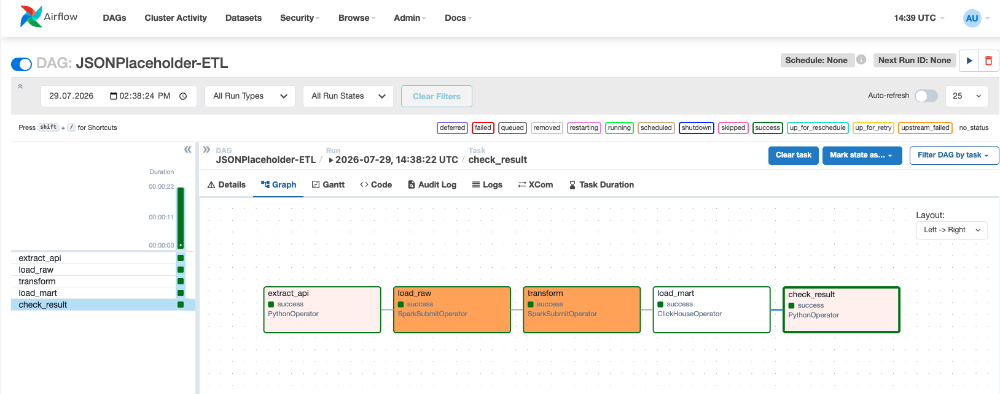

# JSONPlaceholder ETL Pipeline

ETL-пайплайн для загрузки, обработки и анализа данных из публичного API [JSONPlaceholder](https://jsonplaceholder.typicode.com) (данные о пользователях, их постах и комментариях)

**Стек:** Apache Airflow 2.9, Apache Spark 3.5, ClickHouse 24.8, HDFS, Docker

## Слои данных

### RAW слой (JSON с партицией по дате)

JSON-файлы из API с партицией по дате в HDFS

```
/warehouse/raw/JSONPlaceholder/
├── posts/dt=YYYY-MM-DD/posts.json
├── comments/dt=YYYY-MM-DD/comments.json
└── users/dt=YYYY-MM-DD/users.json
```

## ODS слой (Parquet)

Очищенные данные в Parquet (разобраны вложенные поля, приведены типа данных, обработаны дубли и пропуски) в HDFS

```
/warehouse/ods/

├── JSONPlaceholder_posts/posts/*.parquet
├── JSONPlaceholder_comments/comments/*.parquet
└── JSONPlaceholder_users/users/*.parquet
```

## MART слой (Parquet + ClickHouse)

```/warehouse/mart/JSONPlaceholder_UsersActivity/UsersActivity/*.parquet```

## Бизнес-ценность

Проект создает **витрину активности пользователей**, которая показывает:

- Количество постов на пользователя
- Количество комментариев к постам пользователя
- Город и компанию пользователя

Это позволяет аналитикам ответить на вопросы:

- Какие пользователи самые активные?
- Какие компании генерируют больше всего контента?
- Географическое распределение активных пользователей?

## Быстрый старт

```bash
# 1. Клонировать репозиторий
git clone https://github.com/florenskaial118/JSONPlaceholder-ETL.git
cd JSONPlaceholder-ETL

# 2. Запустить через Docker
make airflow

# 3. Активировать DAG в Airflow
# Открыть http://localhost:8088, (admin / admin) и включить DAG 'JSONPlaceholder-ETL'

# 4. Запустить DAG вручную и проверить результат
# DAG выполнит: extract_api >> load_raw >> transform >> load_mart >> check_result
```

## Результат



Пример вывода в логе

```
User 1: 10 posts, 50 comments | Gwenborough | Romaguera-Crona
User 2: 10 posts, 50 comments | Wisokyburgh | Deckow-Crist
User 3: 10 posts, 50 comments | McKenziehaven | Romaguera-Jacobson
User 4: 10 posts, 50 comments | South Elvis | Robel-Corkery
User 5: 10 posts, 50 comments | Roscoeview | Keebler LLC
User 6: 10 posts, 50 comments | South Christy | Considine-Lockman
User 7: 10 posts, 50 comments | Howemouth | Johns Group
User 8: 10 posts, 50 comments | Aliyaview | Abernathy Group
User 9: 10 posts, 50 comments | Bartholomebury | Yost and Sons
User 10: 10 posts, 50 comments | Lebsackbury | Hoeger LLC
```

## Особенности реализации

- Партицирование RAW-слоя по дате для удобного управления данными
- Многоуровневая обработка: RAW → ODS → MART
- Трансформации в Spark:
    - Разбор вложенных структур (address, company)
    - Приведение типов (String → Integer, Double)
    - Удаление дублей и пропусков
- Валидация результата через PythonOperator с выводом в логи


> Docker-контейнеры с Airflow, Spark и ClickHouse подготовлены на основе репозитория [data-engineering-lab](https://github.com/AlexanderForExample/data-engineering-lab).